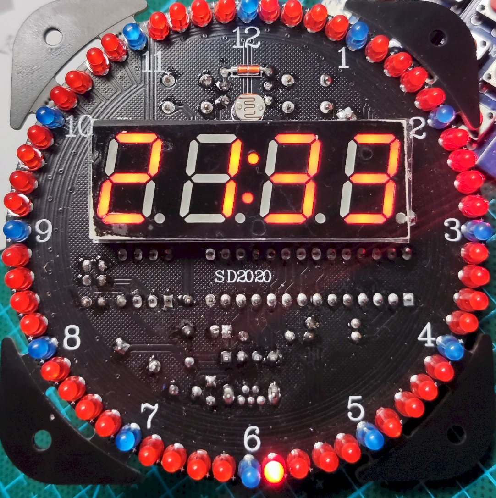
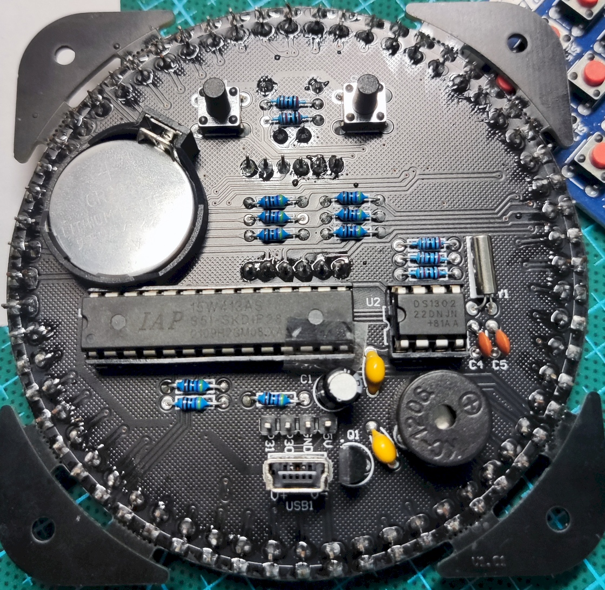
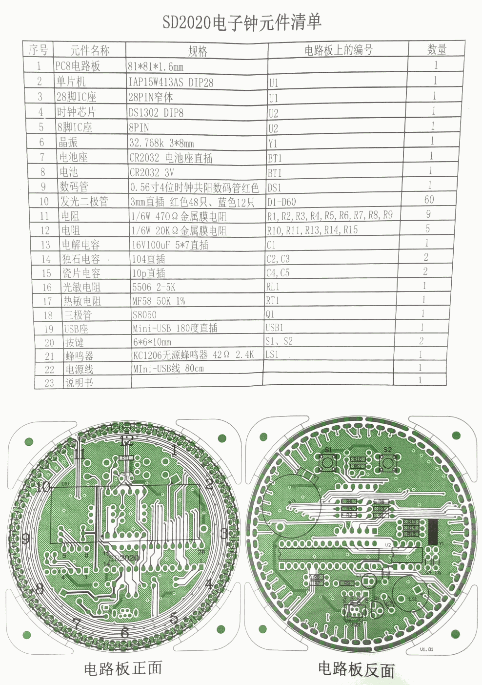

# EC1515S 电子钟程序

因为我的单片机[出现奇怪 bug](https://www.bilibili.com/video/BV1yu411n78X/)，所以项目暂时停止更新。

## 1.复刻原版厂商自带程序

### 1.1.编写器件驱动

- [x]数码管、LED
  - [x]亮度暗度
- [x]按钮
- [x]光敏电阻、温敏电阻
  - [x]转换为光照强度和温度的算法
- [x]DS1302 时钟芯片
- [x]蜂鸣器

### 1.1.1.界面

- 显示界面
  - 按左右键切换显示的内容
  - 同时按切换到调整界面
- 调整界面
  - 双击切换界面中的元素
  - 按左右键调整项目，同时按返回

### 1.2.复刻原版程序行为

- 显示时间、日期、年、温度
- 调整时间
  - 年月日
  - 时分
- 闹钟
  - 调整闹钟开关
  - 调整闹钟时间
- 低光线下显示变暗

## 2.自己设计新功能

- 休眠，省电模式
- 显示秒
- 亮度显示、精确温度显示
- 显示传感器源数据、调整修正值
- eeprom 保存设置
- iap下载歌曲，调整时间
- 整点报时

## 原版参数

[原理图](原理图.pdf)





```
Target model:
  Name: IAP15W413AS
  Magic: F562
  Code flash: 13.0 KB
  EEPROM flash: 0.0 KB
Target frequency: 11.045 MHz
Target BSL version: 7.2.5T
Target wakeup frequency: 37.175 KHz
Target options:
  reset_pin_enabled=False
  clock_source=internal
  clock_gain=high
  watchdog_por_enabled=False
  watchdog_stop_idle=True
  watchdog_prescale=256
  low_voltage_reset=True
  low_voltage_threshold=3
  eeprom_lvd_inhibit=True
  eeprom_erase_enabled=False
  bsl_pindetect_enabled=False
  por_reset_delay=long
  rstout_por_state=high
  uart2_passthrough=False
  uart2_pin_mode=normal
  cpu_core_voltage=unknown
Disconnected!
```
